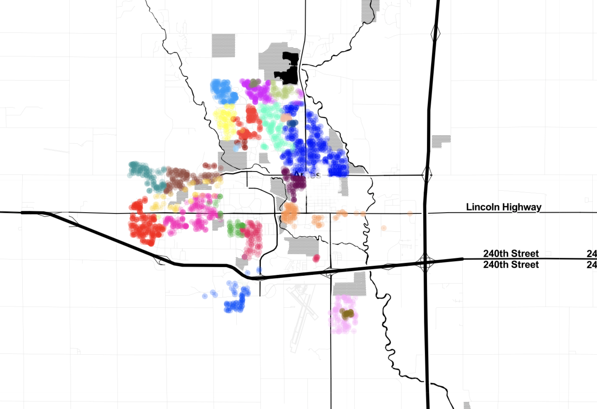

```{r setup, include=FALSE}
options(htmltools.dir.version = FALSE)
knitr::opts_chunk$set(collapse = TRUE,
                      message = FALSE, 
                      warning = FALSE, 
                      fig.align = TRUE, 
                      cache = TRUE, 
                      fig.retina = 3)

library(ymlthis)
library(tidyverse)
library(xaringanExtra)
xaringanExtra::use_panelset()
xaringanExtra::use_share_again()
xaringanExtra::style_share_again(
  share_buttons = c("twitter", "linkedin", "pocket")
)
```

```{r broadcast, echo=FALSE}
xaringanExtra::use_broadcast()
```

class: title-slide, center

.pull-left[


# `r rmarkdown::metadata$title`

## `r rmarkdown::metadata$author`

### `r rmarkdown::metadata$subtitle`
### `r rmarkdown::metadata$date`

]

.pull-right[

<br>
<br>

<div class="row">

<div class="row">

</div>

<div class="column">

</div>

<div class="column">

  </div>

  
<div class="column">

  </div>  
  
  <div class="column">

  </div>  

</div>

]

???

Welcome to the webinar on sharing on short notice

Where we'll show you how to get your teaching materials online with R Markdown.

---

layout: true

<a class="footer-link" href="http://brunaw.com/tidymodels-webinar/slides/slides.html">Talk URL</a>

---

name: clouds
class: center, middle
background-image: url(images/sea.jpg)
background-size: cover

```{css, echo=FALSE}
.panelset {
  --panel-tab-font-family: Work Sans;
  --panel-tab-background-color-active: #fffbe0;
  --panel-tab-border-color-active: #023d4d;
}

.panelset .panel-tabs .panel-tab > a {
	color: #023d4d;
}
```

```{r meta, echo=FALSE}
library(metathis)
meta() %>%
  meta_general(
    description = "Make your teaching more robust & reproducible with R Markdown",
    generator = "xaringan and remark.js"
  ) %>% 
  meta_name("github-repo" = "rstudio-education/teaching-in-production") %>% 
  meta_social(
    title = "Teaching in production",
    url = "https://rstd.io/tip",
    image = "https://repository-images.githubusercontent.com/288797104/d13f1700-e2cc-11ea-9ed7-0bf3a41af1e4",
    image_alt = "R Markdown hedgehog by Allison Horst",
    og_type = "website",
    twitter_card_type = "summary_large_image"
  )
```


## .big-text[Hello]


### Bruna Wundervald


[GitHub: @brunaw](https://github.com/brunaw)  
[Twitter: @bwundervald](https://twitter.com/bwundervald)  
[Page: http://brunaw.com/](http://brunaw.com/)


---
class: middle, center

## .big-text[Today]


<div class="flex" style="margin: 0 1em;">
  <div class="column">
    
  </div>
  
???

Here's who I know you are...

--
   <div class="column"style="margin: 0 1em;">
    <h3> Design matrices   </h3>
    
  </div>
  

???

--
   <div class="column"style="margin: 0 1em;">
    <h3> Resampling  </h3>
    
  </div>
  

???

--
   <div class="column"style="margin: 0 1em;">
    <h3> Model interfaces </h3>
    
  </div>
  

???

--
   <div class="column"style="margin: 0 1em;">
    <h3> Tuning hyperparameters  </h3>
    
  </div>
  

???


You have R Markdown files for teaching...


---
class: middle 

# The `tidymodels` package

- Created by [Max Kuhn](https://github.com/topepo) and the `tidymodels` team 

- Aims to be a unified collection of packages for modelling & machine
learning in `R`


- Easily integrates with the `tidyverse` packages 

- Highly reusable infrastructure & reproducibility 


> The packages presented today are only the **main** ones 

---
background-color: #fef9c8

## Steps

  1. Train and test separation with `rsample`
  2. Model specification and fitting with `parsnip`
  3. Feature engineering with `recipes`
  4. Hyperparameter tuning with `tune`
  
## Good practice: suffixes 

- `_mod` for a `parsnip` model specification
- `_fit` for a fitted model
- `_rec` for a recipe
- `_tune` for a tuning object


---
class: middle 
.pull-left[  
## Data: Ames Housing

A data set from De Cock (2011) with 82 columns recorded for 2,930 properties in Ames IA. 

Target variable: Sale price
Predictors: 
  - Location (e.g. neighborhood, lat and long) 
  - House elements (garage, year built, air conditioner,
 number of bedrooms/baths, etc)
]

.pull-right[

```{r, echo = FALSE}

```


]


---
class: middle

## Loading the data and the packages

```{r}
# Loading libraries
library(tidyverse)
library(tidymodels)

data(ames, package = "modeldata")
ames <- ames %>% mutate(Sale_Price = log10(Sale_Price))
```


---
class: middle

## A peek at the distribution of the sale prices 

```{r, echo = FALSE, fig.align='center'}
ames %>%  
  ggplot(aes(x = Sale_Price)) +
  geom_density(fill = "#ff6767", alpha = 1) +
  labs(x = "Target Variable", y = "Density") +
  theme_classic(18)
```


---
class: middle
background-color: #fef9c8

# 1. Train and test separation with `rsample`

.panelset[
.panel[.panel-name[Train and test split]

```{r}
set.seed(2021)
data_split <- initial_split(ames, strata = "Sale_Price", prop = 0.8)

# Separating train and test
ames_train <- training(data_split)
ames_test  <- testing(data_split)
```
]

.panel[.panel-name[Result]

```{r error=TRUE}
data_split
```
]

.panel[.panel-name[Training set ]

```{r error=TRUE}
ames_train %>% slice(1:3)
```
]
]

---
class: middle

# Resampling - more options: 

  - Bootstrap 
  - Cross-validation:
    - V-fold
    - Leave-one-out
    - Nested
    - Monte Carlo
---
class: middle
background-color: #fef9c8

# 2. Model specification and fitting with `parsnip` 

  1. Create a model specification: the type of model you want to run (lm, random forest, ...)
  2. Set an engine: the package used to run this model
  3. Fit the model
  
  
**List of available models:**  https://www.tidymodels.org/find/parsnip/  
---
class: middle

.panelset[
.panel[.panel-name[Setup and fit]

```{r}

model_setup <- rand_forest(mode = "regression", trees = 100)

rf_mod <- set_engine(model_setup, "ranger")

rf_fit <- fit(
  rf_mod, Sale_Price ~ Longitude + Latitude,
  data = ames_train
)
```
]

.panel[.panel-name[Result]

```{r error=TRUE, echo = FALSE}
rf_fit$fit
```
]
]

---
class: middle

# `parsnip`: switching engines 

.panelset[
.panel[.panel-name[Setup and fit]

```{r}
rf_mod <- model_setup %>% set_engine("randomForest")

rf_fit <- fit(
  rf_mod, Sale_Price ~ Longitude + Latitude,
  data = ames_train
)
```
]

.panel[.panel-name[Result]

```{r error=TRUE, echo = FALSE}
rf_fit$fit
```
]
]

---
class: middle

.panelset[
.panel[.panel-name[Making predictions]

```{r}
test_pred <- rf_fit %>% 
  predict(ames_test) %>% 
  bind_cols(ames_test)

rmse <- test_pred %>%  rmse(Sale_Price, .pred)
# (the rmse function comes from the yardstick package (!))
```
]

.panel[.panel-name[Result]

```{r error=TRUE, echo = FALSE, fig.align='center'}
test_pred %>% 
  ggplot(aes(x = Sale_Price, y = .pred)) +
  geom_point(colour = "#ff6767", alpha = 1) +
  geom_abline() + 
  labs(x = "Target Variable", y = "Density", 
       title = 
         paste0("Test MSE: ", round(rmse$.estimate^2, 3))) +
  theme_classic(18) +
  coord_obs_pred()
```
]
]

---
class: middle, center

```{r, echo = FALSE}
knitr::include_graphics("https://github.com/allisonhorst/stats-illustrations/raw/master/rstats-artwork/parsnip.png")
```

---
class: middle
background-color: #fef9c8

# 3. Feature engineering with `recipes`

 1. Create a `recipe()` to define the processing of the data, e.g.:
  - Create new classes, clean missing data, transform variables, etc
 2. Calculate that in the training set with the `prep()` function
 3. Apply the pre-processing with the `bake()` and 
 `juice()` functions 
  - The `bake()` function is used for 'new data', such as test sets
  
---
class: middle
.panelset[
.panel[.panel-name[The recipe]

```{r}
mod_rec <- recipe(
  Sale_Price ~ Longitude + Latitude + Neighborhood +
    Central_Air + Year_Built, 
  data = ames_train
) %>%
  # Factor levels that occur in <= 5% of data as "other"
  step_other(Neighborhood, threshold = 0.05) %>%
  # Create dummy variables for all factor variables
  step_dummy(all_nominal()) %>% 
  # Adds an interaction term
  step_interact(~ starts_with("Central_Air"):Year_Built) 
```
]

.panel[.panel-name[Results]

```{r error=TRUE, echo = FALSE, fig.align='center'}
mod_rec
```
]

.panel[.panel-name[Prepping]

```{r error=TRUE}
ames_rec <- prep(mod_rec, training = ames_train, verbose = TRUE)
```
]

.panel[.panel-name[Fitting]

```{r error=TRUE}
rf_mod <- rand_forest(
  mode = "regression", mtry = 5, trees = 500) %>% 
  set_engine("ranger", regularization.factor = 0.5)

rf_fit <- rf_mod %>% 
  fit(Sale_Price ~ ., data = juice(ames_rec)) 
```
]

.panel[.panel-name[New fit]

```{r error=TRUE, echo = FALSE, fig.align='center'}
rf_fit$fit
```
]
]


---
class: middle, center

```{r, echo = FALSE}
knitr::include_graphics("https://github.com/allisonhorst/stats-illustrations/raw/master/rstats-artwork/recipes.png")
```


---
class: middle
background-color: #fef9c8

# 4. Hyperparameter tuning with `tune`

1. Choose the hyperparameters to tune
2. Choose the tuning method
3. Run and select the best hyperparameters


  - We'll be doing grid search, but the package offers more options:
    - Bayesian optimization
    - Simulated annealing (`{finetune}` package)
    - Racing methods (`{finetune}` package)

---
class: middle

.panelset[
.panel[.panel-name[Tune setup]
```{r}
ctrl <- control_grid(save_pred = TRUE)

rf_mod <- rand_forest(mtry = tune()) %>%
  set_mode("regression") %>%
  set_engine("ranger", regularization.factor = tune())

rf_param <- parameters(rf_mod)
```
]

.panel[.panel-name[Result]

```{r, echo = FALSE}
rf_param
```
]

.panel[.panel-name[Running the tuning]

```{r}
set.seed(2021)
data_folds <- vfold_cv(data = juice(ames_rec), v = 5)
ranger_tune <-
  rf_mod %>%
  tune_grid(
    Sale_Price ~ ., 
    resamples = data_folds,
    grid = 10,
    control = ctrl
  )
```
]
]

---
class: middle


## Evaluating performance results 

.panelset[
.panel[.panel-name[RMSE plot]

```{r, echo = FALSE, fig.align='center', out.height="30%", out.width="40%"}
autoplot(ranger_tune, metric = "rmse") + 
  geom_point(colour = "#ff6767", size = 3) +
  geom_hline(yintercept = 0.091, linetype = 'dotted') +
  scale_x_continuous(breaks = scales::pretty_breaks()) +
  scale_y_continuous(breaks = scales::pretty_breaks(n = 7)) +
  theme_classic(18) +
  theme(legend.position = "top")
```
]

.panel[.panel-name[RSQ plot]

```{r, echo = FALSE, fig.align='center',out.height="30%", out.width="40%"}
autoplot(ranger_tune, metric = "rsq") + 
  geom_point(colour = "#ff6767", size = 3) +
  geom_hline(yintercept = 0.73, linetype = 'dotted') +
  scale_x_continuous(breaks = scales::pretty_breaks()) +
  scale_y_continuous(breaks = scales::pretty_breaks(n = 7)) +
  theme_classic(18) +
  theme(legend.position = "top")
```
]

]


---
class: middle

## Using the best hyperparameters

.panelset[
.panel[.panel-name[Best model]

```{r}
best_res <- select_best(ranger_tune, metric = "rmse")
final_rf_mod <- rf_mod <- 
  rand_forest(mtry = best_res$mtry) %>%
  set_mode("regression") %>%
  set_engine("ranger", 
             regularization.factor = best_res$regularization.factor) 

final_rf_fit <- final_rf_mod %>%
  fit(Sale_Price ~ ., data = juice(ames_rec))

```
]

.panel[.panel-name[New predictions]

```{r}
test_bake <- bake(ames_rec, new_data = ames_test)
final_pred <- final_rf_fit %>% 
  predict(test_bake) %>% 
  bind_cols(ames_test)

final_rmse <- final_pred %>%  rmse(Sale_Price, .pred)

```
]

.panel[.panel-name[Final plot]

```{r, echo = FALSE, fig.align='center',out.height="30%", out.width="40%"}
final_pred %>% 
  ggplot(aes(x = Sale_Price, y = .pred)) +
  geom_point(colour = "#ff6767", alpha = 1) +
  geom_abline() + 
  labs(x = "Target Variable", y = "Density", 
       title = 
         paste0("Test MSE: ", round(final_rmse$.estimate^2, 4))) +
  theme_classic(18) +
  coord_obs_pred()
```
]
]


---

## Resources

- [Talk GitHub repository](https://github.com/brunaw/tidymodels-webinar)
- http://tidymodels.org/
  - Tutorials and function documentation
- [Book: Tidy Modeling with `R`](https://www.tmwr.org/)
- [Book: Applied Predictive Modeling](http://appliedpredictivemodeling.com/)
-  [Code: Applied Predictive Modeling](https://github.com/topepo/tidyAPM)

- Max's workshops:
  - https://github.com/topepo/2020-earl-workshop
  - https://github.com/topepo/RPharma-2019-Workshop
  - https://github.com/topepo/nyr-2020
  
---
background-image: url(images/sea.jpg)
background-size: cover
class: center, middle, inverse

## .big-text[Questions?]

---


class: bottom, left, inverse


## Thank you!

### Find me at...
[GitHub: @brunaw](https://github.com/brunaw)  
[Twitter: @bwundervald](https://twitter.com/bwundervald)

[Page: http://brunaw.com/](http://brunaw.com/)


Slides template by [Dr. Alison Hill](http://twitter.com/apreshill) & 
illustrations by [Allison Horst](https://github.com/allisonhorst/stats-illustrations)

